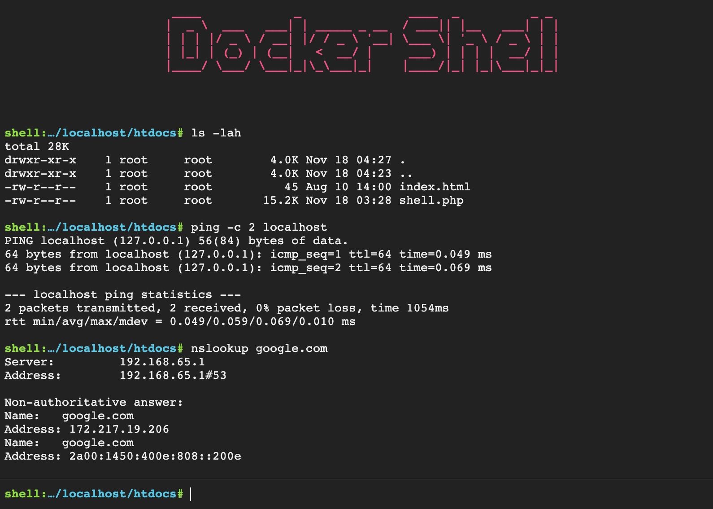

# Docker/Kubernetes WebInterface Shell Access

This is a very basic, single-file, PHP web application into a container, providing you with a shell in that container. It can be used to quickly execute commands on a server or to debug issues in kubernetes or openshift. This is handy if SSH or other methods are blocked or cumbersome, so you can have shell access though a http exposed web service.

## Features

* Command history (using arrow keys `↑` `↓`)
* Auto-completion of command and file names (using `Tab` key)
* Navigate on the remote file-system (using `cd` command)
* Upload a file to the server (using `upload <destination_file_name>` command)
* Download a file from the server (using `download <file_name>` command)

**NOTE:** Do not run infinite commands as the output is only shown once the command returns 

### Installed tools
* apk package manager
* Nginx Web Server (port 80, port 443) - customizable ports!
* wget, curl, httpie, iperf3
* dig, nslookup
* ip, ifconfig, ethtool, mii-tool, route
* ping, nmap, arp, arping, arpwatch
* awk, sed, grep, cut, diff, wc, find, vi, vim, nano
* ps, netstat, ss
* gzip, cpio
* tcpdump, wireshark, tshark
* telnet client, ssh client, ftp client, rsync, scp
* traceroute, tracepath, mtr, tcptraceroute
* nload, tcpflow, nethogs, iftop
* netcat (nc), socat
* ApacheBench (ab)
* mysql & postgresql client
* jq
* git
* kubectl, istioctl, helm

## Usage and installation

### Build locally and run

    $ docker build -t network-tools-web .
    $ docker run -it -p 8080:80 -d network-tools-web
    # open with your browser http://127.0.0.1:8080/shell.php

### Makefile helpers

    $ make
    help                           This help
    build                          Build the container
    build-nc                       Build the container without caching
    run                            Run container
    sh                             Run interactive shell in container
    up                             Build and run container on port configured
    stop                           Stop and remove a running container
    release                        Make a full release
    publish                        Publish the $VERSION and latest tagged containers

### Run from dockerhub

    $ docker run -it -p 8080:80 -d boeboe/network-multitool-web
    # open with your browser http://127.0.0.1:8080/shell.php

### Deploy onto kubernetes

Using yaml files and with service account (for istio cases)

    $ kubectl -n default apply -f ./kubernetes
    # open with your browser http://<node-ip>:30080/shell.php

Using direct deployment without service account

    $ kubectl create deployment multitool-web --image=boeboe/network-multitool-web:1.0.0
    $ kubectl expose deployment multitool-web --type=LoadBalancer --port=80 --target-port=30080
    # open with your browser http://<node-ip>:30080/shell.php

## Changelog

* **2020-11-18:** Initial release
